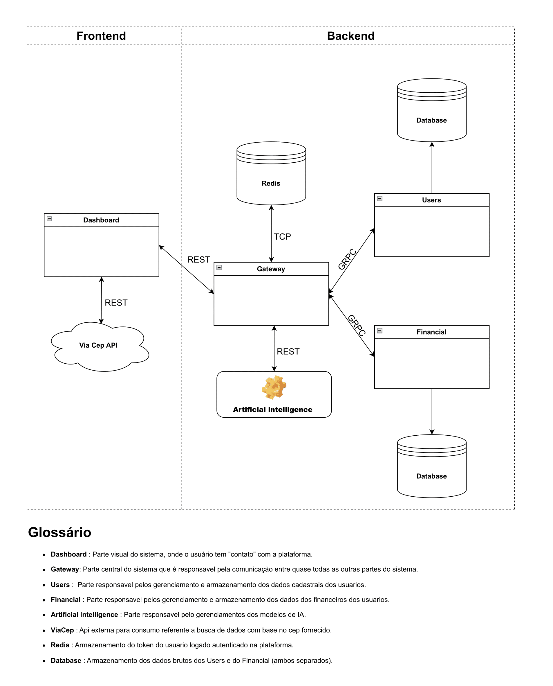

# FitAdmin (AI)

## Introdução

Este projeto é um MVP (Minimum Viable Product) desenvolvido para a PUC-Rio, com o objetivo de colocar em prática os conhecimentos adquiridos no semestre atual. 
Ele representa a terceira parte do projeto com arquitura em microserviço, após a instalação da terceira parte deve clicar no link ao lado [FitAdmin](http://127.0.0.1:5000/).
Para acessar a plataforma só basta colocar admin@fitadmin.com no Email e 12345678 no Password.

---

## Informativo

### 1. **Sobre a proposta**
Nos últimos anos, tem havido um aumento expressivo de brasileiros buscando uma melhor qualidade de vida, com foco na saúde e bem-estar. Com isso, o número de academias abertas em diversas regiões do Brasil cresceu significativamente.

Contudo, muitas academias — especialmente as que não pertencem a grandes redes — ainda oferecem uma experiência ruim para o aluno, desde o cadastro de dados até o gerenciamento financeiro.

Este projeto tem como objetivo desenvolver um sistema completo que resolva esse problema, proporcionando uma experiência mais agradável e dinâmica tanto para o aluno quanto para a academia.

---

### 2. **Sobre a documentação**

**Tecnologias utilizadas:** 
- Flask
- RandomForest 

**Fluxograma:**




---

## Instalação

1. **Clone este repositório**
   ```bash
   git clone git@github.com:JacksonSanti/FitAdmin_AI.git
2. **Após criar o ambiente virtual,instale as dependências necessárias**
   ```bash
   pip install -r requirements.txt
3. **Rodar o comando abaixo para subir este container (é necessário ter o docker instalado)**
   ```bash
   docker compose up -d

---

## Testes

1. **Após estar com o ambiente virtual aberto, basta colocar só o comando abaixo**
   ```bash
   pytest
2. **É possivel criar modelo com base de acordo com o critério de Accuracy, ainda na raiz precisamos fazer a importação antes**
   ```bash
   from Models.Treino.model import create_model as exercise_create_model
   from Models.Serie.model import create_model as series_reps_create_model
3. **Após isso, só bsata colocar a função de acordo com o teste de criação de modelo que quer fazer**
   ```bash
   exercise_create_model()
   series_reps_create_model()